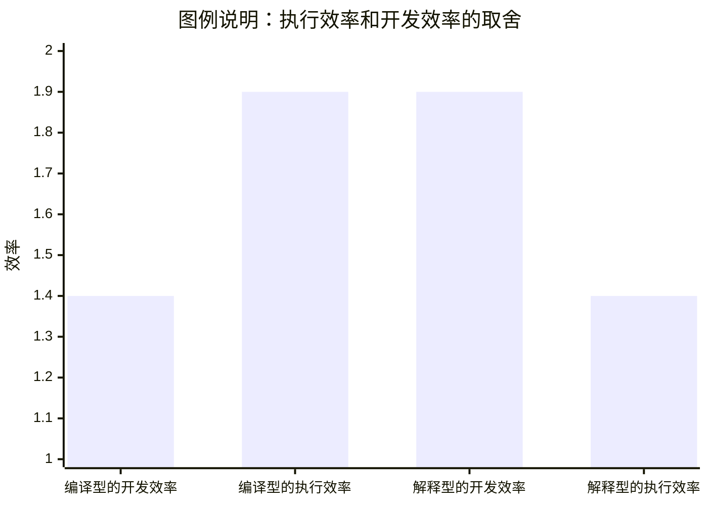

# 设计一门编程语言

编程语言的本质是 “人类与计算机的沟通协议”

## 总体考量

权衡`功能`、`效率`和`实用性`的平衡

`设计目标`与`语言特性`之间存在明确的映射关系，这种映射由语言的需求场景与解决思路驱动。例如，系统级编程语言以直接硬件交互和内存控制为核心目标，因此C语言设计了指针机制以支持直接内存访问，满足底层系统开发对内存操作精度的需求；而脚本语言以快速迭代和动态调整为主要设计目标，如Python通过弱化静态类型声明减少语法约束，降低代码编写与修改的门槛，从而加速开发流程。这种映射关系体现了语言特性是设计目标在语法与语义层面的具体实现，即需求场景决定设计原则，设计原则进一步塑造语言特性。

`执行模型`的选择直接影响开发效率与运行性能的权衡，差异体现在编译型与解释型的划分。
编译型语言（如C、C++）通过静态编译过程将源代码转换为机器码，可在编译阶段进行深度优化（如常量折叠、死代码消除、循环展开等），从而显著提升执行速度，但需经历编译-链接过程，开发周期相对较长；
解释型语言（如Python、JavaScript）则通过解释器动态解析执行源代码，省去编译步骤，支持即时修改与运行，降低了开发门槛并提升了迭代效率，但动态解析过程增加了运行时开销，性能相对较低。

`运行时环境`是执行模型的具体载体，存在共性基础与差异化特征。共性方面，无论何种执行模型，运行时环境均需管理栈内存（用于函数调用上下文与局部变量存储）和堆内存（用于动态内存分配），并维护执行上下文（如程序计数器、寄存器状态、异常处理链等）以确保指令的顺序执行与异常处理。差异则源于执行模型的设计目标：编译型语言（如C）直接生成与硬件架构绑定的机器码，运行时依赖操作系统的内存管理机制，内存布局与硬件直接关联；而采用中间代码执行模型的语言（如Java）通过虚拟机（JVM）实现跨平台，其运行时环境包含字节码解释器、即时编译器（JIT）及垃圾回收器，通过中间层抽象屏蔽硬件差异，以牺牲部分性能为代价换取跨平台兼容性。

>主要组件

组件类型|编译型语言|中间代码型语言|共性功能
---|---|---|---
内存管理 | 直接操作系统内存管理 | 虚拟机托管内存管理 | 栈内存(函数上下文/局部变量) 堆内存(动态分配)
执行机制 | 原生机器码直接执行 | 字节码解释/JIT编译 | 程序计数器 寄存器状态维护
优化方式 | 编译期静态优化 | 运行时动态优化(JIT) | 异常处理链维护
跨平台性 | 需重新编译 | 字节码跨平台执行 | 指令顺序执行保障
典型组件 | 链接器 | 垃圾回收器(GC)、即时编译器(JIT) | 执行上下文管理

## 语法和语义
### 词法和语法结构

权衡`语法`的`简洁性`与`表达力`，能够提升了团队协作中的代码一致性。
- Lisp语言采用S表达式作为统一语法表示，这种简洁性也带来了可读性争议。
- C#等语言则通过引入相对冗余的语法规则降低歧义，通过结构化约束减少了语法解析的二义性

权衡`语法糖`的`便捷性`与`透明性`,避免过度封装导致开发者对性能瓶颈的感知迟钝。
- `语法糖`是语法层面的便捷表示，影响主要体现在开发效率与运行时性能上。
- 它通过简化常用操作的书写形式提升开发效率，例如C#的foreach循环、Python的列表推导式等。
- 它通常隐藏底层实现的性能开销，开发者可能会忽略其背后的迭代器创建、中间集合生成等操作，从而导致非预期的内存占用或计算开销。

权衡`灵活性`和`严谨性`,
- `语法歧义`的产生源于语言规则的模糊性或过度灵活性，其共性来源包括结构冲突与操作符优先级问题。比如“悬挂else”问题：当if语句嵌套时，else子句可能被解析为与最内层或最外层if匹配，多数语言通过“就近匹配”规则（如C、Java）或强制使用代码块（如Python的缩进语法）解决该歧义。
- `运算符重载冲突`则源于`多义性定义`，例如同一运算符在不同类型或上下文中的重载逻辑可能引发`优先级混淆`，语言设计者通常通过严格的运算符优先级表、限制重载范围（如禁止重载基础算术运算符）或要求显式类型转换等策略来降低冲突风险。

### 声明和定义

声明与定义的设计需协同类型系统、作用域机制及模块化需求，其合理性直接影响语言的安全性、灵活性与工程化能力。

与`类型系统`的关联
- 不同的类型系统中，声明语法的**约束度**不同。
- `静态类型`语言通过显式声明实现**编译时类型安全**。（如C、Java）要求变量声明时必须显式指定类型，编译器通过类型声明在编译阶段进行类型检查，确保类型一致性
- `动态类型`语言通过弱化声明要求换取**开发灵活性**。（如Python、JavaScript）则依赖隐式类型推断，变量类型由运行时的赋值操作决定，声明阶段无需显式类型标注。

与变量的`生命周期`和`作用域`的关联（以JavaScript为例）
- var关键字声明的变量遵循函数作用域规则，其生命周期覆盖整个函数执行期间，且存在“变量提升”现象——变量在声明语句前即可被访问（值为undefined），易导致逻辑错误
- let关键字声明的变量引入的块级作用域，将变量生命周期限制在所在代码块（如if、for语句块）内，变量仅在块执行期间有效，且不存在变量提升，有效优化了变量生命周期的可控性。

`可见性控制`其核心作用在两方面：
- 通过限制标识符的可见范围防止命名冲突，例如模块系统（如ES6模块、Python包）通过export/import机制控制变量或函数的跨模块可见性；
- 实现信息隐藏，通过访问修饰符（如Java的private、protected）、语言特性（如Python的下划线前缀约定）隐藏内部实现细节，仅暴露必要的公共接口，降低模块间耦合度，提升代码可维护性。

### 表达式和语句

可提升代码的可读性和可维护性

TODO

## 类型系统

类型系统的设计需在表达力、易用性和实现复杂度之间寻找平衡。

TODO

## 数据模型和内存模型

数据模型决定 "要创建什么数据"，内存模型决定 "数据存哪里、能放多久"

对比项|数据模型|内存模型
---|---|---
关注层面|逻辑层面（数据如何组织和使用）|物理层面（数据如何存储和管理）
可见性|开发者直接定义和使用|多隐藏在语言实现中（除 C 等底层语言）
核心问题|"数据应该是什么样的？"|"数据应该放在哪里？"

>例子：以用户登录为例，说明两者如何协同
- 数据模型
    - 定义User 对象的结构，比如id/name/token
    - 添加登录状态逻辑
- 内存模型
    - 用户的交互数据，存放在栈内存（函数调用结束自动清除）
    - user 对象，存放在堆内存（登录状态保持期间存在）
    - 全局登录状态标志 → 存放在全局内存（整个程序运行期可见）

### 数码模型

数据模型 = 类型系统 + 结构化组织 + 操作接口

名称|含义
---|---
类型系统|数据的分类与约束
结构化组织|数据间的关系与组合方式
操作接口|操作和行为规范

### 内存模型
程序运行时，数据在内存中的存储位置、生命周期和访问规则的总和。

内存管理是内存模型的实现方式。

名称|特点
---|---
栈内存|容量小、存取快、离开自动清空（函数内局部变量）
堆内存|容量大、需登记（new/malloc）和注销（delete/free）
全局内存|所有人可见、持续整个程序运行期

## 模块化和代码组织

模块系统通过将代码划分为独立单元（比如按功能或逻辑边界进行分离），从而为大规模软件开发中的代码管理提供结构化支持。

不同模块或第三方库有可能定义了同名标识符，需要`命名空间`进行有效隔离才行。
C++语言为例，其标准库通过std命名空间封装所有标准组件，开发者需通过std::限定符访问（如std::vector）。这种机制将全局命名空间划分为逻辑独立的子空间，显著降低了大型项目中名称冲突的风险，为模块化协作提供了基础支持。

`作用域嵌套`是编程语言中普遍存在的结构，但可能引发名称隐藏问题。当内层作用域声明与外层作用域同名的标识符时，内层标识符会**遮蔽**外层标识符，导致意外的语义错误。
例如，在C++中，若全局作用域存在变量x，而函数内部又声明了同名局部变量x，则函数内对x的访问默认指向局部变量，全局变量被隐藏。
为解决此类问题，语言层面提供了针对性方案：C++引入作用域解析运算符::，允许通过::x显式访问全局变量；Python则通过global关键字在局部作用域中声明变量为全局属性，**避免局部变量对全局变量的遮蔽**。这些机制通过**显式指定作用域层级**，增强了代码的确定性和可维护性。

命名空间和命名规范的合理设计直接影响代码可读性。
- 一致的命名空间层次结构（如按功能模块或业务逻辑划分）能够帮助开发者快速定位标识符的所属范围，降低认知负担。
- 遵循统一的命名风格（如驼峰式或下划线式）与命名空间层级相结合，能进一步减少歧义，使代码的逻辑关系直观可见，从而降低维护成本并减少人为错误。

## 静态与动态特性

### 静态特性与编译时行为

`类型声明`与`内存空间分配`在非运行时（即编译阶段）进行的机制。
这种机制通过在程序执行前确定数据类型和内存布局，为后续的静态分析与编译时优化奠定基础。
类型声明的提前绑定使得编译器能够在编译阶段对数据操作的合法性进行初步校验，而空间分配的预执行则减少了运行时的内存管理开销，间接提升了程序的执行效率。
尽管当前材料未直接涉及静态分析对代码质量的具体提升效果、不同语言编译时优化能力的对比，以及静态元编程的应用场景与局限性，但静态特性中编译时对类型与空间的预处理，本质上是静态分析与编译时优化的前提条件，其设计逻辑直接影响后续代码质量保障与性能优化的可行性。

### 动态特性与运行时行为

`类型声明`和`内存空间分配`在程序运行时进行的机制。
其本质在于将传统静态语言中要在编译阶段完成的`类型检查`与`内存管理操作`延迟至程序执行过程中。
- 该特效为快速开发原型提供了便利。开发者无需在编码初期严格定义变量类型，可通过动态调整数据结构加速迭代过程；
- 该特性也伴随显著风险。由于类型错误只能在运行时暴露，程序的稳定性依赖于执行路径的全面覆盖，导致潜在的运行时错误难以在开发阶段被充分预测和排查。

`反射机制`是动态特性的重要表现形式：
- 反射允许程序在运行时访问和修改类的私有成员，直接破坏了面向对象设计的封装原则，增加了代码维护的复杂度；
- 动态类型解析和元数据查询会引入额外的性能开销，尤其在高频调用场景下可能成为系统瓶颈。

针对动态语言的调试与测试，其策略需重点应对运行时行为的不确定性。由于编译阶段缺乏严格的类型校验，动态语言通常要求更高的单元测试覆盖率，以通过多场景执行验证类型兼容性和逻辑正确性。同时，依赖运行时断言成为关键手段，通过在代码中嵌入动态条件判断（如类型检查、参数验证），可在异常行为发生时即时捕获错误，降低故障排查的难度。上述策略虽能缓解动态特性带来的风险，但也对开发流程的规范性和测试资源的投入提出了更高要求。

## 控制流与结构化编程
### 控制流
结构化编程主张通过顺序、分支、循环三种基本控制结构及函数调用，来实现复杂控制流，替代goto语句这种非结构化跳转。
### 函数与过程抽象
TODO
要想提高软件开发的效率与质量，你想要解决代码复用、模块化设计和逻辑封装。
在代码复用层面，函数抽象通过高阶函数与闭包两种关键形式拓展了复用能力。
- 高阶函数支持将函数作为参数传递或返回值，这一特性为实现策略模式提供了简洁途径——通过动态传入不同函数实现算法的灵活切换，避免了传统面向对象策略模式中大量接口定义与类实现的冗余，从而提升代码的可维护性与扩展性。
- 闭包则通过捕获外部作用域的上下文状态，使函数能够携带状态信息独立运行，这种特性在需要维持局部状态但避免全局变量污染的场景中尤为重要，例如在事件处理或状态机实现中，闭包可封装状态逻辑，实现更细粒度的代码复用。

参数传递机制的语义差异直接影响函数调用的安全性与副作用控制。在Python与Java等采用按共享传递（Call by Sharing）语义的语言中，对象引用被传递给函数参数，其行为表现为“不可变对象安全，可变对象风险”。对于不可变对象（如Python的整数、字符串，Java的String、Integer），函数内部对参数的修改会创建新对象，原对象不受影响，因此不存在副作用风险；而对于可变对象（如Python的列表、字典，Java的ArrayList、HashMap），函数内部对对象成员的修改会直接影响原对象，可能导致意外的状态变更，需通过防御性复制等手段规避风险。这种语义差异要求开发者在设计函数接口时，明确区分参数的可变性，以确保代码行为的可预测性。

递归作为函数抽象的特殊形式，在特定问题领域具有不可替代的优势，但其应用也存在固有局限。递归的适用场景主要包括树结构遍历（如二叉树的深度优先搜索、XML文档解析）和分治算法（如快速排序、归并排序、斐波那契数列计算），这些场景中问题的递归定义与解法天然契合，代码实现简洁直观。然而，递归的限制同样显著：深度递归调用可能导致调用栈溢出，尤其在缺乏尾递归优化支持的语言（如Python、Java）中，即使逻辑上可尾递归的算法也无法避免栈溢出风险。尾递归优化通过将递归调用转换为迭代执行，可有效消除栈溢出隐患，但该特性依赖语言编译器或解释器的原生支持，目前仅在部分函数式语言（如Scheme、Haskell）中得到完善实现。

## 并发与并行编程
### 并发模型
TODO
并发模型的设计核心在于高效利用计算资源并避免资源竞争，其基础构建块与通信范式的选择直接影响系统性能与可靠性。在并发原语层面，操作系统级别的线程与进程依赖内核调度，其上下文切换涉及特权级转换、寄存器保存与恢复等操作，导致较高的调度开销；相比之下，协程作为用户态轻量级执行单元，通过用户空间调度器实现上下文切换，避免了内核态与用户态的频繁切换，显著降低了切换成本，从而支持更高的并发密度。这种性能特征差异决定了线程/进程适用于粗粒度任务并行，而协程更适合I/O密集型或细粒度任务场景。

在数据共享与通信机制方面，共享内存与消息传递构成了两种主流设计范式。共享内存模型通过直接访问公共内存区域实现数据交互，具有低延迟与高数据访问效率的优势，但需依赖锁、信号量等同步原语保证数据一致性，易引发死锁、优先级反转等问题；消息传递模型则通过显式消息交换实现协作，天然避免了共享状态带来的竞争风险，但其通信过程涉及消息序列化、复制与传输，引入了额外的开销。典型案例包括Go语言的CSP（通信顺序进程）模型，通过channel实现消息传递以确保并发安全性，而Java则基于synchronized关键字与volatile变量构建共享内存同步机制，二者分别体现了不同设计理念下的权衡取舍。

并发编程实践中普遍面临三类核心问题：死锁表现为多个执行单元因循环等待资源而陷入无限阻塞；竞态条件源于多个线程非同步访问共享资源，导致结果不确定性；活锁则是执行单元持续响应对方行为却无法推进任务的特殊状态。为应对这些问题，静态分析工具可在编译阶段通过代码路径遍历检测潜在死锁风险与竞态条件，而运行时监控工具则通过跟踪线程状态、锁持有情况与资源访问序列，实时识别异常行为，二者共同构成了并发正确性保障的重要手段。

### 异步编程模式
TODO
异步编程模式作为编程语言通用知识框架的重要组成部分，其核心价值在于优化I/O密集型任务的执行效率。通过采用非阻塞I/O机制，异步模式能够显著减少程序在等待外部资源（如网络请求、磁盘读写）时的闲置时间，典型案例包括Node.js基于事件循环的模型，该模型通过单线程处理并发请求，将I/O操作委托给系统内核，从而在高并发场景下实现高效的资源利用率。

在代码实现层面，异步编程的可读性挑战长期存在。早期的回调函数模式虽能实现异步逻辑，但在多层嵌套场景下易导致“回调地狱”，表现为代码结构混乱、逻辑链断裂，增加了维护难度。相比之下，现代编程语言引入的async/await语法通过将异步操作线性化表达，有效改善了代码的可读性和可维护性，使异步逻辑的书写方式接近同步代码的线性结构，降低了思维负担。

不同编程语言根据其设计理念和应用场景，形成了多样化的并行计算实现方案。例如，C++通过OpenMP库支持基于共享内存的并行编程，允许开发者通过编译指令快速实现循环级并行；Python的multiprocessing模块则通过创建独立进程避免全局解释器锁（GIL）的限制，适用于CPU密集型任务的并行化；Rust的rayon库则利用安全的内存模型和任务调度机制，提供了简洁的并行迭代接口，平衡了性能与安全性。这些实现反映了异步与并行编程在语言生态中的差异化优化路径。
## 编程范式
### 主流范式特性
TODO
近年来，编程语言领域呈现出显著的范式融合趋势，即单一语言通过整合多种编程范式的特性以增强表达能力和适用范围。例如，JavaScript作为典型的多范式语言，同时支持命令式、函数式和面向对象范式，其设计中融合了面向对象的原型继承机制与函数式的高阶函数、闭包等特性，允许开发者根据具体场景灵活选择编程风格。类似地，C++20标准引入概念（Concepts）特性，进一步强化了对泛型编程范式的支持，使得代码在编译时的类型检查更为严格，同时与既有的面向对象和命令式特性形成互补，体现了范式融合的行业实践。

不同编程范式在问题建模中展现出差异化的适配性，其核心设计理念决定了对特定问题域的支持能力。命令式范式通过显式的状态修改和步骤化指令序列描述计算过程，适合数值计算等需要精确控制执行步骤和状态变化的场景，例如科学计算中的迭代算法实现。函数式范式强调纯函数和无副作用，通过数据流的转换与组合实现计算，适用于数据流处理等对数据一致性和可并行性要求较高的场景，如分布式系统中的事件流处理。面向对象范式则通过类与对象的封装、继承和多态机制，有效建模现实世界中的复杂实体及其交互关系，适合处理具有明确层次结构和行为特征的复杂系统，例如企业级应用中的业务实体管理。

多范式语言在整合多种特性时面临两大核心设计挑战。其一，保持范式正交性，即不同范式的特性应尽可能独立，避免相互干扰。例如，JavaScript中面向对象的原型系统与函数式的一等函数特性需要在语法设计和语义定义上保持清晰边界，确保开发者可独立使用任一范式而产生意外行为。其二，避免特性冲突，当不同范式的设计理念存在内在差异时（如命令式的状态可变与函数式的不可变性），需通过语言规范或编译器机制协调潜在冲突，确保语言整体的一致性和易用性。

### 范式实践与应用场景
范式选择对代码可维护性具有显著影响，不同范式通过其核心特性解决特定维护挑战。函数式编程强调不可变性，通过限制状态修改减少因共享可变状态导致的并发错误和逻辑异常，从而降低调试复杂度并提升代码稳定性。相比之下，面向对象编程（OOP）的封装机制通过隐藏内部实现细节、暴露明确接口，简化了模块间的协作逻辑，减少了外部代码对内部实现的依赖，进而降低了修改时的连锁影响。

设计模式的实现与编程范式存在内在关联，特定模式的有效性依赖于范式提供的语言特性。例如，策略模式通过将算法封装为可替换组件实现行为动态切换，这一机制依赖函数式编程中的高阶函数特性，允许将函数作为参数传递以实现算法的灵活组合。而观察者模式则依赖OOP的多态机制，通过定义观察者接口，使主题对象能够统一通知不同类型的观察者实例，实现对象间的松耦合通信。

跨范式编程的最佳实践在于根据问题域特性选择主导范式，并针对性地融合互补范式的优势。在数据处理场景中，函数式编程的不可变性和高阶函数可提升代码的可读性和并行处理能力；在复杂系统建模场景中，OOP的封装、继承和多态更适合表达对象间的层次关系和交互逻辑。混合范式应用时，可将函数式的纯函数作为OOP对象的方法实现，或在函数式代码中引入OOP的封装思想管理局部状态，以实现代码灵活性与可维护性的平衡。

## 元编程与扩展性
### 元编程机制
TODO
元编程作为编程语言扩展表达力的重要手段，通过让代码具备操作代码的能力，显著提升了语言处理复杂逻辑和简化重复任务的能力。在语言表达力扩展方面，元编程机制能够针对特定场景生成或优化代码结构。例如，C++的模板系统允许开发者定义通用的容器类（如std::vector），通过在编译时指定类型参数，既保证了代码的复用性，又通过编译期类型检查确保了类型安全，避免了运行时类型错误的风险。类似地，Rust的宏系统（如声明宏和过程宏）可通过模式匹配生成重复性代码，例如自动为结构体实现Debug或Serialize等常用 trait，大幅减少手动编写的冗余代码，同时保持逻辑的一致性。

元编程在实现方式上可分为编译时与运行时两类，二者在性能、灵活性和适用场景上存在显著权衡。编译时元编程（如C++模板元编程、Rust宏、D语言的编译时函数执行）在程序编译阶段完成代码生成或计算，其优势在于能够将运行时的计算开销转移至编译期，从而提升程序运行效率；但代价是增加编译时间，尤其是复杂的元编程逻辑可能导致编译过程显著延长，影响开发迭代效率。运行时元编程（如Python的反射机制、JavaScript的Proxy对象、Ruby的元编程特性）则在程序执行期间动态修改代码行为，例如动态添加类方法或修改对象属性，具有更高的灵活性，能够适应运行时变化的需求；然而，动态操作通常伴随额外的性能开销，且可能绕过编译期的类型检查，增加运行时错误的风险。

尽管元编程带来了显著的表达力提升，但其应用过程中也存在不可忽视的风险。首先，元编程代码往往具有较高的抽象度，例如复杂的C++模板嵌套或Rust宏展开逻辑，可能导致代码可读性下降，增加其他开发者理解代码意图的难度。其次，调试难度显著增加：编译时元编程的错误信息通常较为晦涩（如C++模板展开错误），而运行时元编程的动态行为难以通过静态分析工具追踪，问题定位耗时。最后，过度使用元编程可能导致系统维护成本激增，由于元编程逻辑与业务逻辑深度耦合，后续修改或扩展可能需要同时理解元编程机制和具体业务场景，增加了维护的复杂性和出错概率。因此，在实践中需权衡元编程的收益与潜在风险，避免滥用。

### 语言扩展性与生态
TODO
语言扩展性是影响其生态系统繁荣程度的关键因素之一。开放且灵活的扩展机制能够显著降低开发者参与门槛，吸引社区贡献，进而推动生态规模的扩张。以JavaScript为例，其动态类型、原型继承及运行时修改能力等特性，为第三方库和工具的开发提供了高度自由度。这种灵活性直接促成了npm（Node Package Manager）生态系统的爆发式增长，使其成为目前全球最大的开源包管理平台之一，拥有数百万可复用的模块。类似地，Python的动态特性与丰富的元编程工具（如装饰器、元类）也为其生态扩展提供了便利，吸引了大量开发者为科学计算、Web开发等领域贡献库和框架。

互操作性的实现复杂度则是影响语言生态协同发展的重要挑战。跨语言调用需解决类型系统差异、内存管理边界及执行模型兼容等核心问题。在类型转换方面，静态类型语言（如Java）与动态类型语言（如Python）的交互常面临类型信息丢失或转换错误的风险，需通过中间表示（如Protocol Buffers）或桥接工具（如JNI、Py4J）进行适配。内存管理层面，采用垃圾回收机制的语言（如C#）与手动内存管理的语言（如C++）交互时，可能因内存所有权模糊导致泄漏或悬垂指针问题，需设计严格的内存边界协议（如COM接口的引用计数机制）。此外，跨语言调用的性能开销（如序列化/反序列化耗时）也可能限制互操作性的实际应用场景。

健康的编程语言生态系统通常具备以下特征：其一，标准化接口为组件协作提供统一规范，例如POSIX标准确保了C语言在不同操作系统中的兼容性，而Java的JSR规范则推动了跨平台库的开发。其二，版本兼容性保障机制降低了依赖升级风险，语义化版本控制（Semantic Versioning）通过主版本号、次版本号和修订号的清晰定义，帮助开发者判断兼容性变化，减少依赖冲突。其三，完善的文档与工具链提升开发效率，如 Rust 的 Cargo 工具链整合了构建、测试、依赖管理功能，配合详尽的官方文档和社区教程，显著降低了学习和使用门槛。这些特征共同构成了生态系统可持续发展的基础，促进语言在不同领域的渗透与应用。

特征|说明|典型案例
---|---|---
标准化接口|为组件协作提供统一规范|POSIX标准(C)、JSR规范(Java)
版本兼容性保障机制|通过明确定义的版本控制降低依赖升级风险|语义化版本控制(Semantic Versioning)
完善的文档与工具链|整合构建、测试、依赖管理功能，降低学习和使用门槛|Rust的Cargo工具链及官方文档
